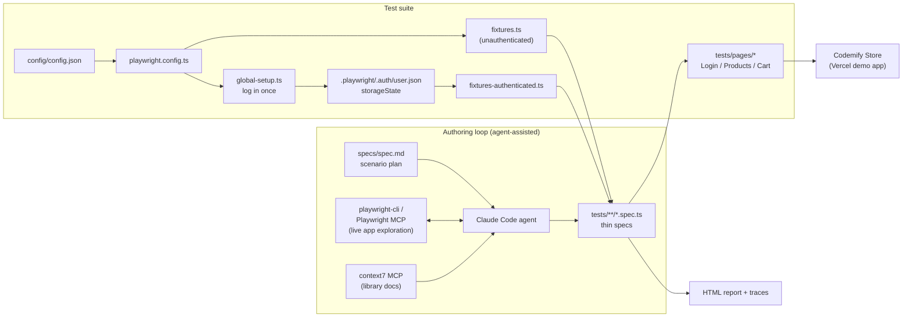
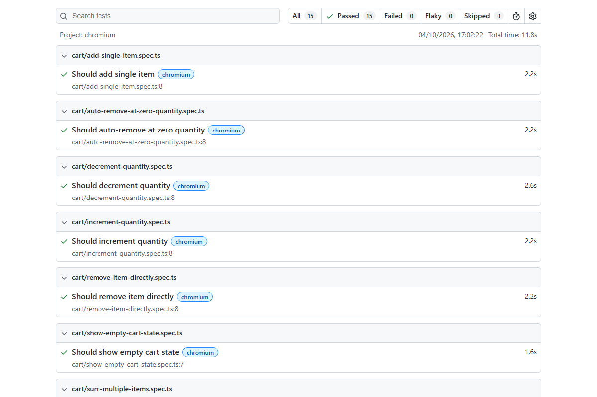

# playwright-agentic-testing

A Playwright + TypeScript end-to-end suite for the
[Codemify Store demo app](https://codemify-demo-app.vercel.app/demo-app),
built with an **agent-assisted, spec-driven workflow**: an AI agent explores the
live app, verifies locators against it, and generates tests from a written plan
instead of guessing selectors.

## The problem

Hand-written E2E suites are slow to author, and AI-generated ones tend to
invent locators that don't exist. This repo tries to get the speed of an agent
without the guesswork:

1. **Plan:** every scenario is written down once in [`specs/spec.md`](specs/spec.md)
   with numbered steps and expected outcomes.
2. **Generate:** the agent drives the real app through
   [`playwright-cli`](https://github.com/microsoft/playwright-cli) and the
   Playwright MCP server, confirms each locator, then writes the spec file.
3. **Heal:** when a test fails, the agent reproduces it live and fixes the
   cause (see the `debugging-failing-playwright-tests` skill in `.claude/skills`).

Conventions the agent must follow live in
[`docs/playwright-best-practices.md`](docs/playwright-best-practices.md) and
[`CLAUDE.md`](CLAUDE.md).

## Architecture



- **Two fixture tracks.** `fixtures.ts` starts logged out (only the login specs
  use it); `fixtures-authenticated.ts` reuses a `storageState` saved once by
  `global-setup.ts`, so no other test pays for a login.
- **Page Object Model.** One class per screen; specs compose POM methods and
  assert, and don't hold raw locators the POM already exposes.
- **Config, not constants.** URL, credentials and timeouts come from
  `config/config.json` (gitignored; `config.example.json` is the template).

## Run it in 3 commands

```bash
npm ci && npx playwright install --with-deps
cp config/config.example.json config/config.json
npx playwright test --project=chromium
```

Then `npx playwright show-report` to open the report. The config holds public
demo credentials only. There is also a Docker image (`npm run docker:build`,
`npm run docker:run`) and a GitHub Actions workflow that builds `config.json`
from repository variables (see [`docs/ci-github-actions.md`](docs/ci-github-actions.md)).

## Sample report

Latest local run on chromium: **15 passed, 0 failed, 0 flaky** (11.8s).



## Status

Tracked in [`specs/progress.md`](specs/progress.md).

| Area | Scenarios | State |
|---|---|---|
| Login | 4 | done |
| Products | 2 | done |
| Cart | 7 | done |
| Checkout | 4 | planned |

## What I learned / trade-offs

- **The agent is only as good as what it can see.** Having it verify locators
  in the live app first removed most invented selectors. The cost: every
  scenario needs a browser session before any code is written.
- **Match the app's real quirks exactly.** The cart decrement button is the
  Unicode minus `−` (U+2212), not `-`, and line totals use `×`. Checkout
  fields use native HTML5 validation, so there is no error text to assert on;
  tests check focus / `:invalid` instead.
- **Two fixtures instead of a login in every test.** Saving `storageState`
  once is faster and keeps specs focused, but it couples every authenticated
  test to one account and one global-setup run.
- **Expected values are typed by hand** in `tests/test-data.ts`, not computed
  from the app's own arithmetic, so a pricing bug can't hide itself.
- **Plans rot, so I deleted the code-level one.** A detailed implementation
  plan drifted from the real POM shape within weeks; the scenario spec plus
  `progress.md` stayed useful, so those are the source of truth now.
- **Known gap:** `update-cart-badge-on-add.spec.ts` failed once and never
  reproduced in 51 reruns. The suspect is a one-shot read of the badge count
  instead of a retrying assertion. Not fixed yet.
- **Tooling caveat:** `--debug=cli` + `playwright-cli attach` doesn't pause
  with this version pairing (`@playwright/test` 1.61.1 vs `@playwright/cli`
  0.1.15), so live exploration uses `playwright-cli open` + `state-load`.
- **Only chromium is run for the sample report.** The suite is configured for
  chromium, firefox and webkit, and CI runs all three.

## Repo layout

```
specs/          scenario plan + generation progress
tests/          fixtures, global setup, specs (login/ products/ cart/)
tests/pages/    page objects
docs/           testing conventions, CI notes, design docs
.claude/        agent skills (playwright-cli, debugging, PR review)
.mcp.json       Playwright + context7 MCP servers for the agent
```
